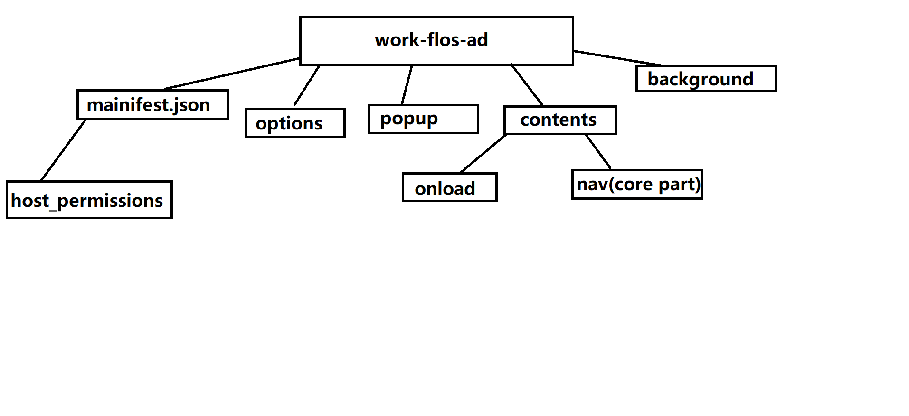

# 快速开始
## yarn
## pnpm dev
## 安装插件后打开 https://workflos.ai/

## 插件作用
1. 漂浮的广告导航栏
2. workflos页面背景色变为粉色

# 目录结构

# 浏览器插件七大属性
1.mainifest.json
2.content-scripts(向页面注入js,css,但是不能访问页面的js,他和页面共享DOM,但不共享js,只能通过injected script,他只能访问四种chrome.api,1.extension,2.i18n,3.runtime,4.storage)
3.injected-script(指的是通过DOM操作的方式向页面注入的一种JS)
4.background(后台，一个html，常驻页面)
5.event-pages(它的生命周期是：在被需要时加载，在空闲时被关闭，什么叫被需要时呢？比如第一次安装、插件更新、有content-script向它发送消息，等等。主要是怕background长时间挂载太消耗性能，比background多了一个persistent参数)
6.popup交互页面（一个icon和一个html）
7.homepage_url(作者网站链接)

# 创建content-scripts两种方式
1.直接在源文件创建content.ts
2.创建contents目录，在下面添加多个，每一个都是独立的（推荐）